# Array
# Array
An array is an object that holds values (of any type) not particularly in named 
properties/keys, but rather in numerically indexed positions

# Change the Elements of an Arra
You can also add elements or change the elements by accessing the index 
value.
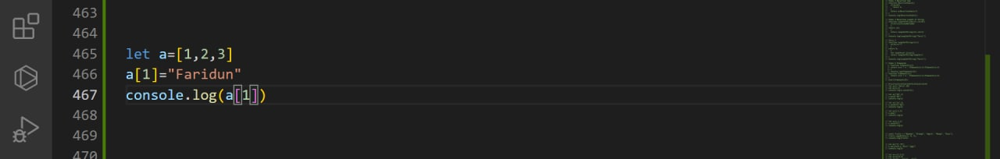
Suppose, an array has two elements. If you try to add an element at index 3 (fourth 
element), the third element will be undefined. For example

Basically, if you try to add elements to high indices, the indices in between 
will have undefined value
# The JavaScript Array Object
The Array object is used to store multiple values in a single variable:
Array indexes are zero-based: The first element in the array is 0, the second is 1, and so on.

//METHODS
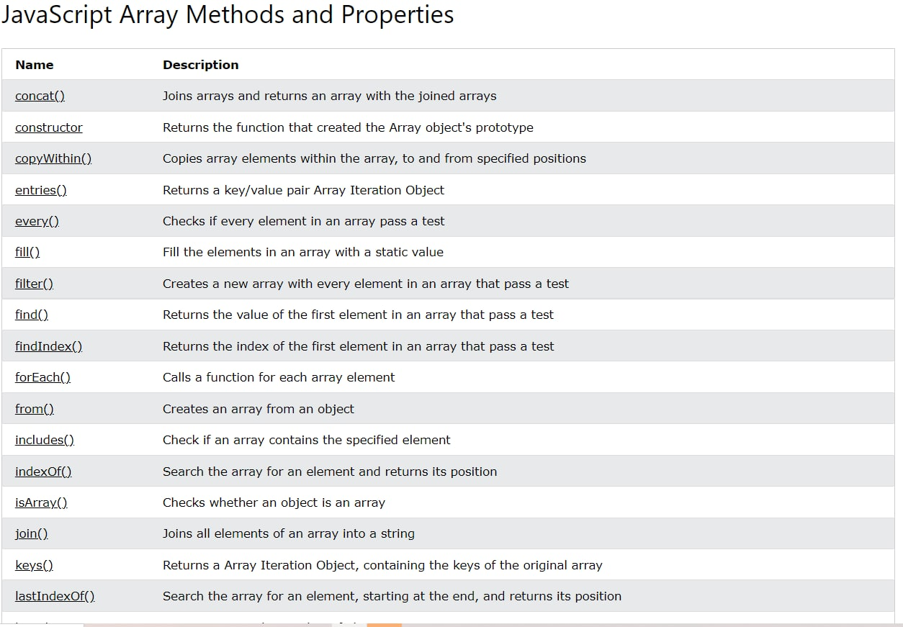
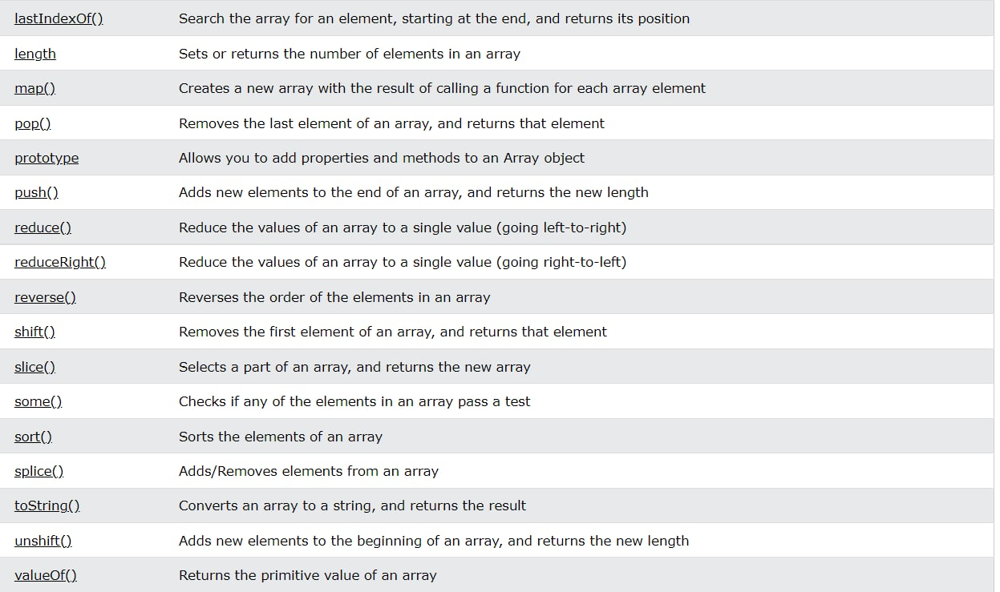

# JavaScript Array concat()
Join two arrays:
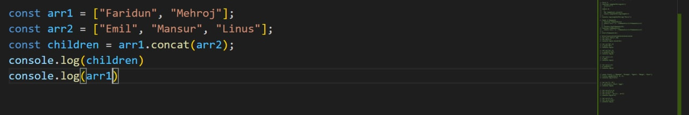
The concat() method concatenates (joins) two or more arrays.
The concat() method returns a new array, containing the joined arrays.
The concat() method does not change the existing arrays.

# JavaScript Array constructor
Get the array constructor:
The constructor property returns the function that created the Array prototype.

For JavaScript arrays the constructor property returns:
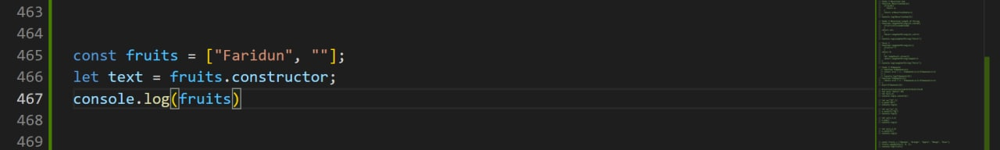

# JavaScript Arrayfilter()
Return an array of all values in ages[] that are 18 or over:
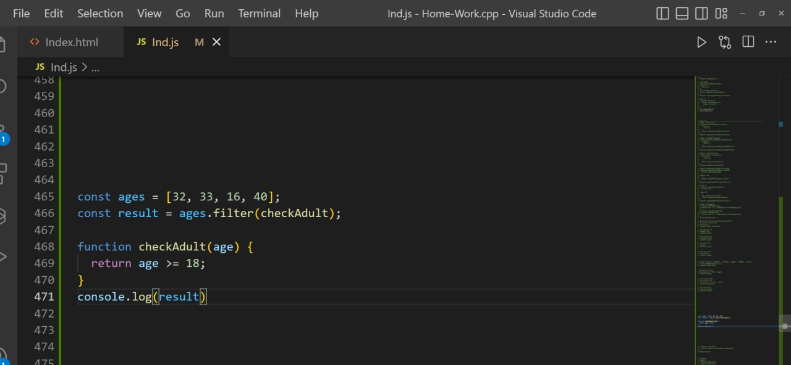
The filter() method creates a new array filled with elements that pass a test provided by a function.
The filter() method does not execute the function for empty elements.
The filter() method does not change the original array.
# JavaScript Array forEach()
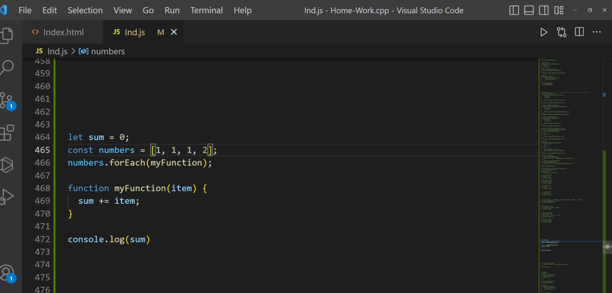

# JavaScript Array includes()
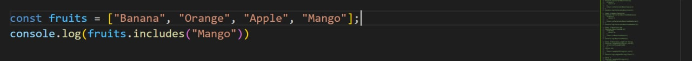
The includes() method returns true if an array contains a specified value.

The includes() method returns false if the value is not found.

The includes() method is case sensitive.

# JavaScript Array indexOf()
Find the first index of "Apple":
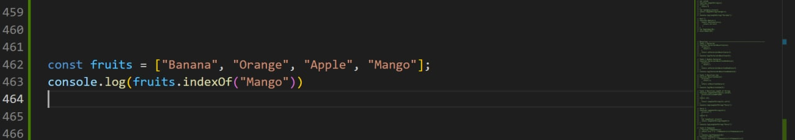
# JavaScript Array.isArray()
Check if an object is an aray:
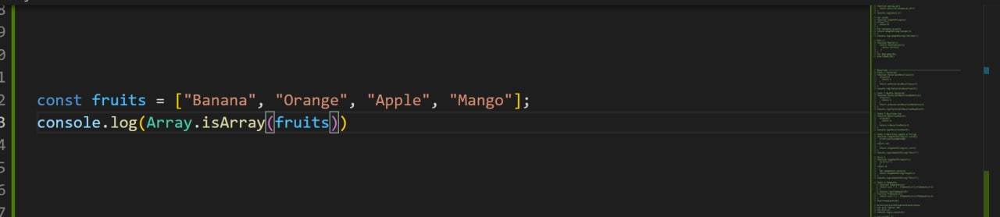
# JavaScript Array join()
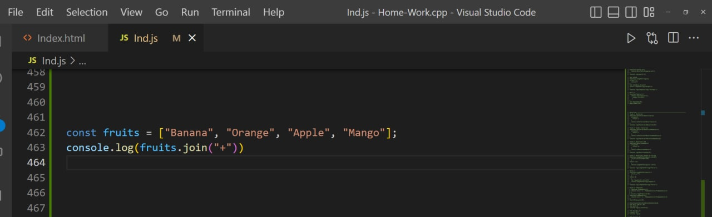
# JavaScript Array length
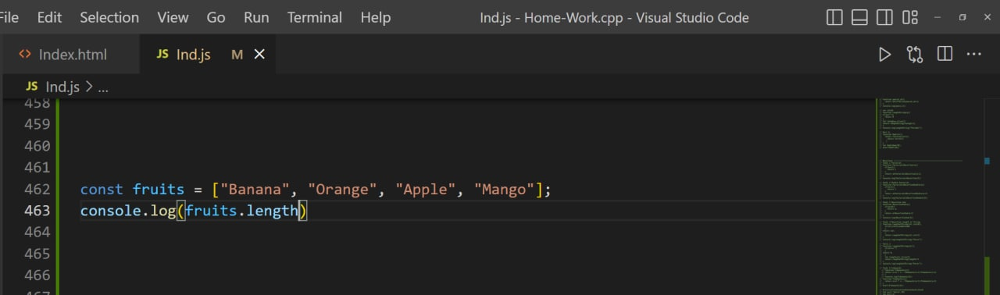
# JavaScript Array map()
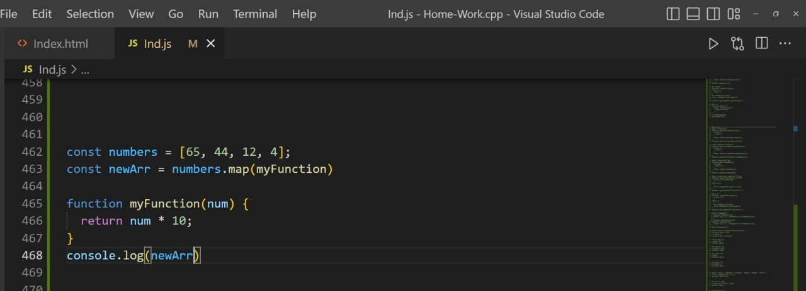
# JavaScript Array pop()
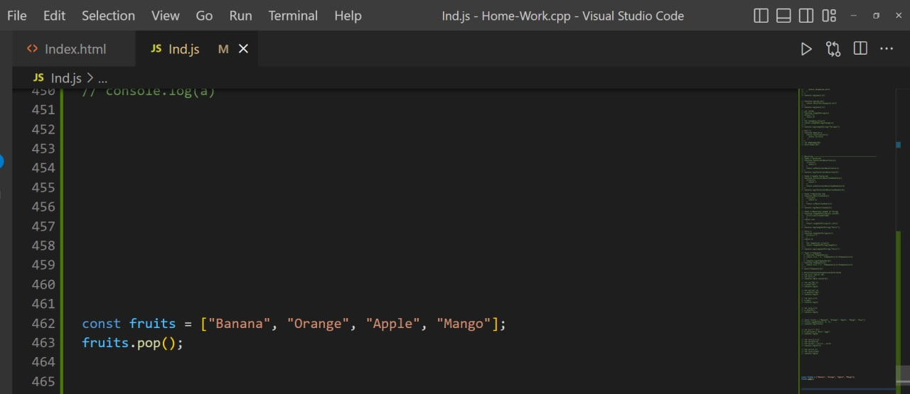
# JavaScript Array push()
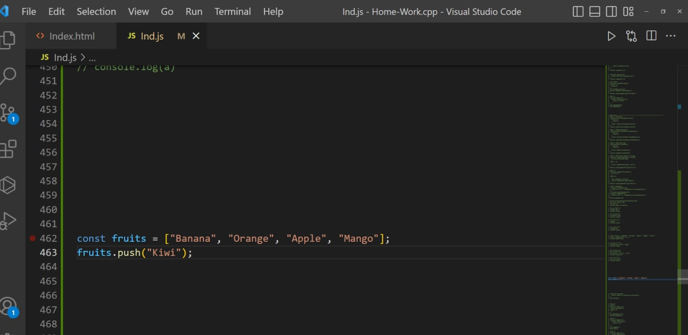
# JavaScript Array reverse()
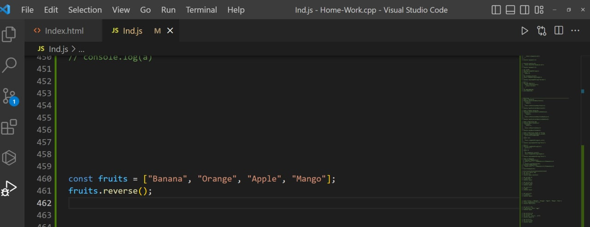
# JavaScript Array shift()
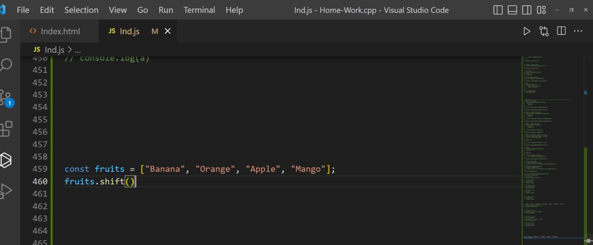
# JavaScript Array slice()
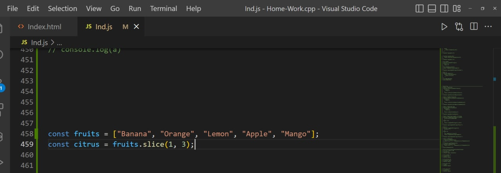
# JavaScript Array splice()
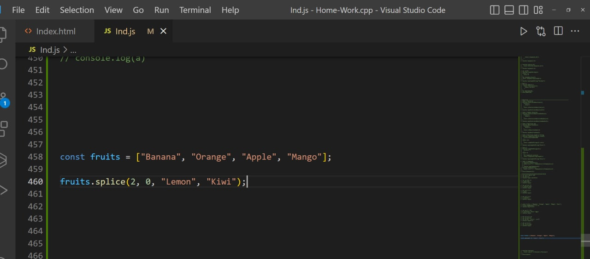
# JavaScript Array toString()
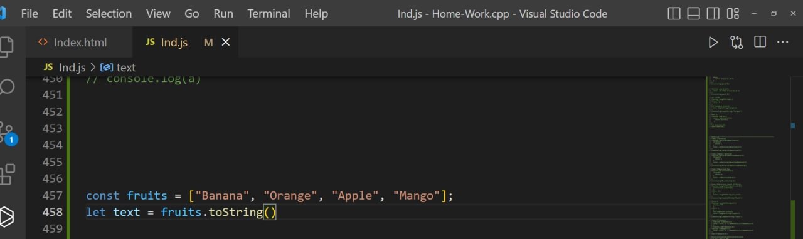
# Destructuring, spread and rest – spread
The spread operator ... is used to expand or spread an iterable or an array. 
For example
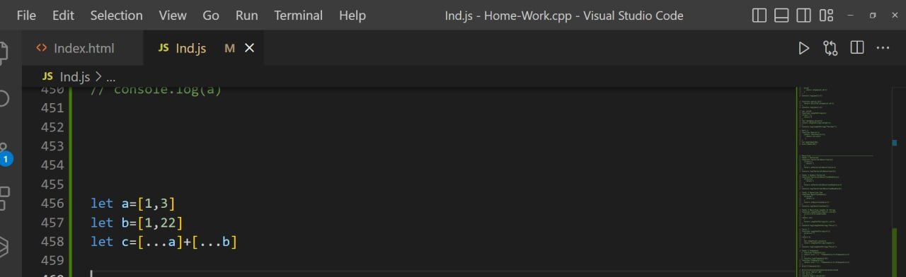

# Destructuring,
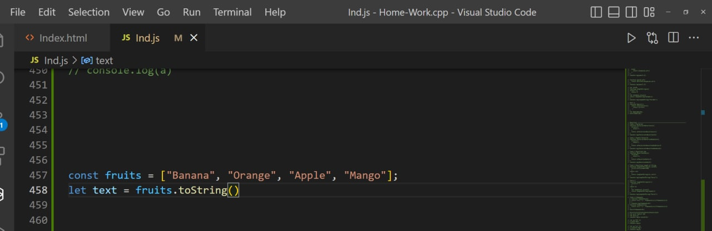

